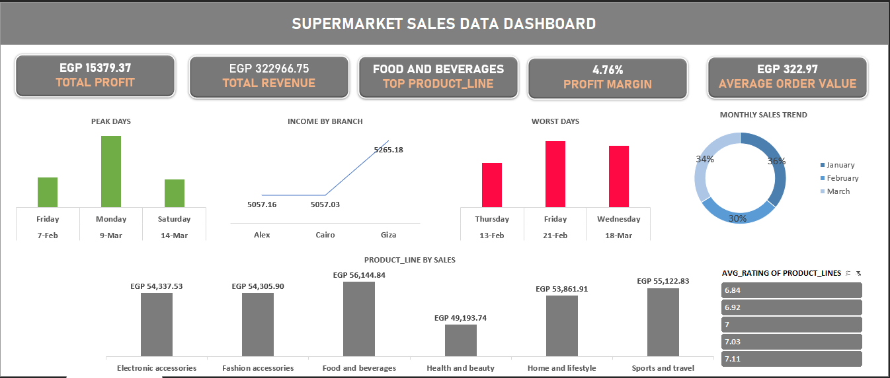

# Supermarket-Sales-Analysis
An interactive Egyptian sales dashboard built with Excel + SQL analyzing 3 months of supermarket sales, profit and other KPIs. Dataset downloaded from Kaggle.

Kaggle Dataset: [Supermarket Sales Dataset](https://www.kaggle.com/datasets/faresashraf1001/supermarket-sales/data)

## Key Insights
- **Total Revenue**: EGP 322,966.75
- **Total profit**: EGP 15,379.37
- **Top Product_Line**: Food and Beverages drove the most sales and most profit.
- **Worst Product_Line**: Health and Beauty had the worst sales and profit combined.
- **Profit Margin**: 4.76% profit margin means costs and other expenses are eating deep into revenue. Small changes in pricing will have
a huge impact on profit.
- **Average Order Value**: EGP 322.97 AOV suggests mostly small, individual purchases. Raising AOV by just 50 EGP would increase revenue
through product bundling by 15%.
- **Top Month**: January 2020 with EGP 116,291.87 in sales.

## Tools and Skills Used
  - **SQL**: Data extraction, cleaning, aggregation, and KPI calculations from the dataset.
  - **Microsoft Excel**: Pivot Tables, KPI cards, Charts, Slicers.
  -  **Data Validation**: Verified dataset quality, checked for nulls/duplicates before carrying out analysis.
    
## Charts Included
  - **Peak Days**
  - **Income by Branch**
  - **Worst Days**
  - **Monthly Sales Trend**
  - **Product_Line by Sales**
  - **Average Product Rating slicer**
 
## Key Takeaways and Recommendations
  Based on the insights above:
  - A 4.76% profit margin means costs and other expenses are eating deep into revenue. Small increases in pricing will have a huge
impact on profit.
  - An Average Order Value (AOV) of EGP 322.97 suggests mostly small, individual purchases. Implementing bundling of complementary products will increase revenue.
  - With Food and Beverages topping sales and profit, increasing budget allocation for this product_line would see revenue soar.

 All KPIs and aggregated tables were created in SQL first. See [`SUPERMARKET_QUERIES.SQL`](./supermarket_kpi_queries.sql).

 ## Files
 - 01 [`Raw Dataset`](./01_raw_dataset.csv)
 - 02 [`Datatype Standardization wit SQL`](./02_supermarket_datatype_standardization.sql)
 - 03 [`Supermarket KPI Queries`](./03_supermarket_kpi_queries.sql)
 - 04 [`Sales Dashboard`](./04_supermarket_sales_dashboard.xlsx)
 - 05 [`Dashboard Screenshot`](./05_dashboard_screenshot.png)
 - 06 [`Full Workbook`](./06_full_workbook.xlsx)

